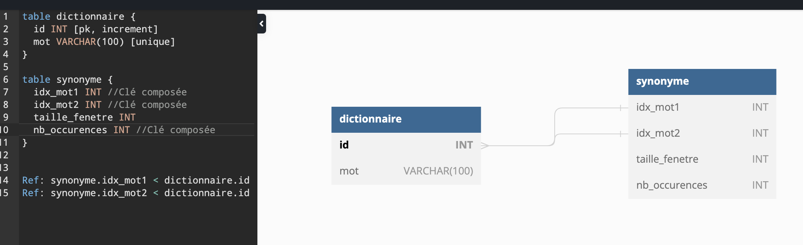

# Projets Intelligence Artificielle II
## Équipe : Jessica Chan et Sebastian Perez
Répertoire C62 (IA) contenant les TP1, TP2 et TP3 de la session A2022

# Dossier TP1 : 
Création d'un dictionnaire de synonymes fournissant une liste des n meilleurs synonymes pour un mot fournit à la ligne de commande en prenant compte la taille de fenêtre, de l'encodage, du fichier texte et la valeur du verbose à l'exécution.  

**Notes**
La ligne de commande du programme peut prendre un quatrième arguments (0 ou 1) pour l'affichage du temps.
Si la valeur n'est pas définie au départ, elle est automatiquement initialisée à 0 et n'affichera pas le temps.

**Les méthodes de score :**  
- 0 : Produit scalaire
- 1 : Least-squares
- 2 : City-block 

# Dossier TP2 : 
Utilisation d'une base de données pour emmagasiner les données qui nous ont permis d'effectuer les comparaisons du TP1

## Structure de la base de données utilisée

**Notes**  
Pour partir le programme, commencer par faire la commande ``python mainBD.py -b`` pour créer la base de données avant de faire l'entraînement suivi de la recherche.
La ligne de commande du programme peut prendre l'argument facultatif -v lors de l'entraînement et la recherche pour afficher le temps. S'il n'est pas utilisé, le temps ne sera pas affiché.

# Dossier TP3 : 
- se deplacer dans le fichier TP3 et entrer :
## Pour utiliser utiliser le K-means: 
- -c pour cluster 
- -t pour la taille de fênetre
- -k pour le nombre de centroïdes   
- -n pour le nombre maximal de mots affichés par cluster 

<code>mainCluster.py -c -t 5 -k 3 -n 10 </code>

## Pour utiliser le Knn : 

- mot represente le mot à chercher et nb_voisin le nombre de voisins désiré
  
<code>knn.py utf-8 mot nb_voisin </code>
